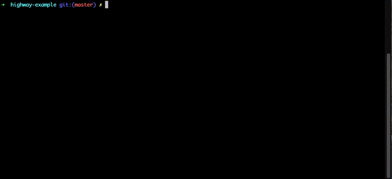

**Highway** combines what’s best about Bitrise and Fastlane into one tool. It is a build system built on top of Fastlane.

## Goal

* **Combine what's best of Bitrise.yml and Fastlane.** Highway prefers declarative configuration over convenience and takes advantage of a broad library of steps provided by Fastlane.
* **Reduce feedback loops.** Provide information faster and in more detail so that you don't waste time, especially when integrated with Danger.
* **Bring us closer to Continuous Delivery.** Highway allows to easily take advantage of existing tools to finally implement production CD in our projects.
* **Allow centralization of configuration.** Provide a first-party support to set default values and behaviors across projects. In the future, adding e.g. Carthage-Rome to our projects will be a matter of editing a central “default” configuration file in some repository.

## Getting started

You're probably looking for a quick reference how to implement Highway in your project, right?

We keep all of the end-user documentation in our [wiki](https://github.com/netguru/highway/wiki/).

Some quick links: [Installation](https://github.com/netguru/highway/wiki/Installation), [Configuration](https://github.com/netguru/highway/wiki/Configuration), [Why Highway was created](https://github.com/netguru/highway/wiki#why-highway-was-created).

## Contributing

If you have ideas of new features that could be supported in Highway, feel free to [create an issue](https://github.com/netguru/highway/issues/new)!

## Authors

* **[Adrian Kashivskyy](https://github.com/akashivskyy)** - *Initial work* - *Highway Foundations* -
* **[Piotr Sękara](https://github.com/piotr-sekara)** - *Steps* - *Unit Tests* - *Fixes* -

See also the list of [contributors](https://github.com/netguru/highway/contributors) who participated in this project.

## License

This project is licensed under the MIT License.